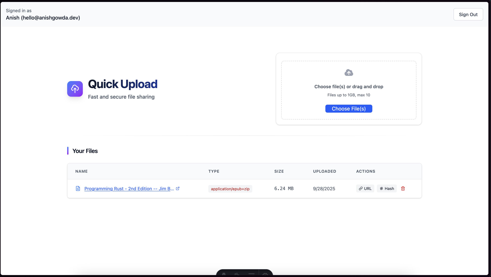

# Quick Upload ⚡️(Personal)


This app was made for personal use. If you wanna clone it and make it work, set these env vars:

```
UPLOADTHING_TOKEN=
UPLOADTHING_CALLBACK_URL=   # production only

BETTER_AUTH_SECRET=
PUBLIC_BETTER_AUTH_URL=       # same as below (needed on frontend, so double-declare)
BETTER_AUTH_URL=              # same as above

TURSO_DATABASE_URL=
TURSO_AUTH_TOKEN=
```

## Where to get these

- `UPLOADTHING_TOKEN`  
  Head to [UploadThing](https://uploadthing.com/) dashboard → API Keys. Create a key and drop it here.  
  `UPLOADTHING_CALLBACK_URL` is your deployed site URL (e.g., https://yourdomain.com) for production.

- `BETTER_AUTH_SECRET`  
  Generate a random string (32+ chars). You can use:  
  `bunx nanoid` or `openssl rand -base64 32` (anything long and secret works).

- `BETTER_AUTH_URL` and `PUBLIC_BETTER_AUTH_URL`  
  Both should be your app’s base URL.

  - Local: `http://localhost:4321` (Astro default)
  - Prod: your deployed URL.  
    Keep them identical, just remember the `PUBLIC_` version is exposed to the client.

- `TURSO_DATABASE_URL` and `TURSO_AUTH_TOKEN`  
  From Turso dashboard → your database → Connection details. Create a token and copy the URL + token.

## Tech Stack

- Astro
- React
- Tailwind CSS
- Drizzle ORM
- TanStack Query
- TanStack Table
- UploadThing
- Turso (libSQL)

## Getting Started (with Bun)

```
# 1) Install deps
bun install

# 2) Copy env example and fill values
cp .env.example .env

# 3) Run dev server
bun run dev
```

## Tips

- If uploads fail locally, double-check `UPLOADTHING_TOKEN` and that your URL vars match your actual origin.
- For prod, set `UPLOADTHING_CALLBACK_URL` to your live domain so webhooks/callbacks behave.
- Drizzle + Turso: if you need to push schema, run your drizzle migrations after setting the Turso vars.
